# NestJS: The Complete Developer's Guide - Stephen Grider
https://www.udemy.com/course/nestjs-the-complete-developers-guide/

# Table of Contents

1. [Section 1: Get Started Here!](#section-1-get-started-here)
1. [Section 2: The Basics of Nest](#section-2-the-basics-of-nest)
1. [Section 3: Generating Projects with the Nest CLI](#section-3-generating-projects-with-the-nest-cli)
1. [Section 4: Validating Request Data with Pipes](#section-4-validating-request-data-with-pipes)
1. [Section 5: Nest Architecture: Services and Repositories](#section-5-nest-architecture-services-and-repositories)
1. [Section 6: Nest Architecture: Organizing Code with Modules](#section-6-nest-architecture-organizing-code-with-modules)
1. [Section 7: Big Project Time!](#section-7-big-project-time)
1. [Section 8: Persisting Data with TypeORM](#section-8-persisting-data-with-typeorm)
1. [Section 9: Creating and Saving User Data](#section-9-creating-and-saving-user-data)
1. [Section 10: Custom Data Serialization](#section-10-custom-data-serialization)
1. [Section 11: Authentication From Scratch](#section-11-authentication-from-scratch)
1. [Section 12: Getting Started with Unit Testing](#section-12-getting-started-with-unit-testing)
1. [Section 13: Integration Testing](#section-13-integration-testing)
1. [Section 14: Managing App Configuration](#section-14-managing-app-configuration)
1. [Section 15: Relations with TypeORM](#section-15-relations-with-typeorm)
1. [Section 16: A Basic Permissions System](#section-16-a-basic-permissions-system)
1. [Section 17: Query Builders with TypeORM](#section-17-query-builders-with-typeorm)
1. [Section 18: Production Deployment](#section-18-production-deployment)
1. [Section 19: [Bonus] Appendix: TypeScript](#section-19-bonus-appendix-typescript)

# Section 1: Get Started Here!

---

 

# Section 2: The Basics of Nest

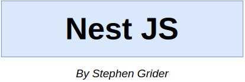

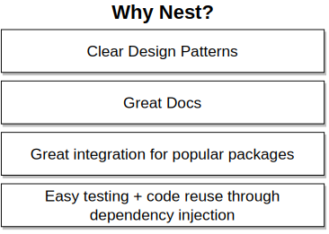
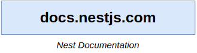
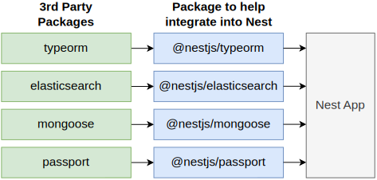
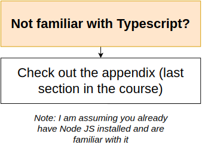
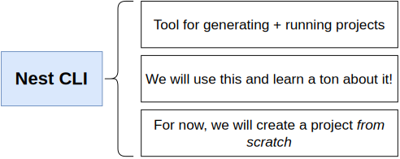
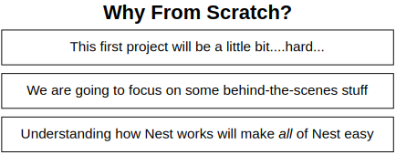
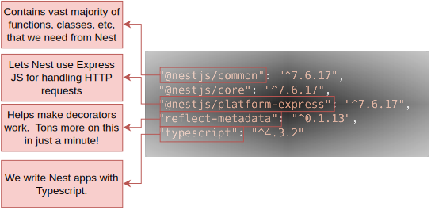
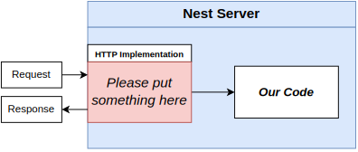
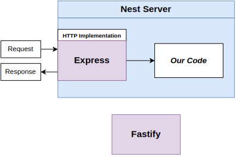
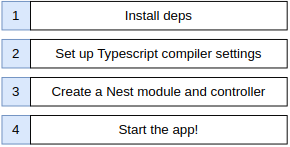
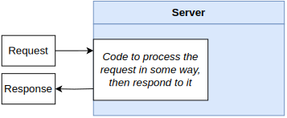
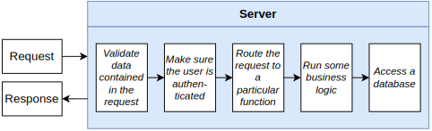
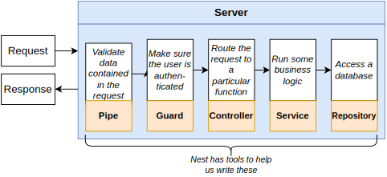
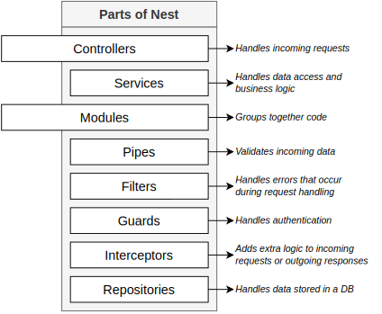
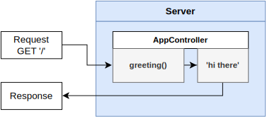
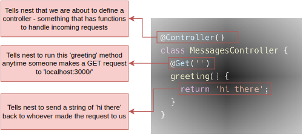
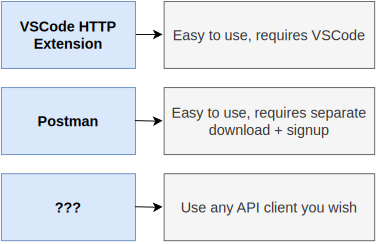

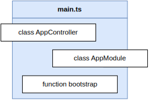
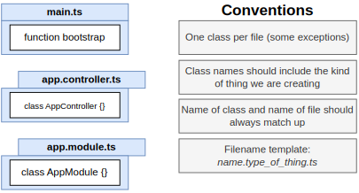

---

 

# Section 3: Generating Projects with the Nest CLI

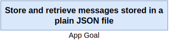
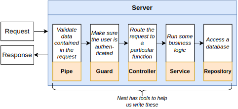
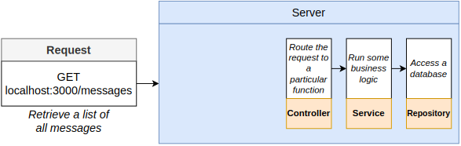
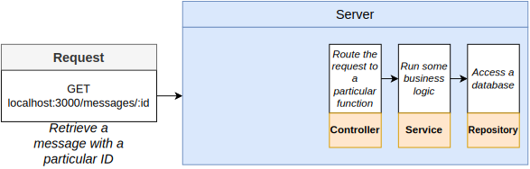
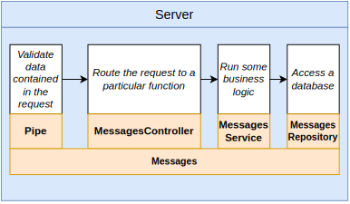
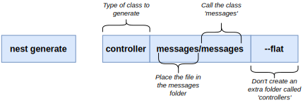
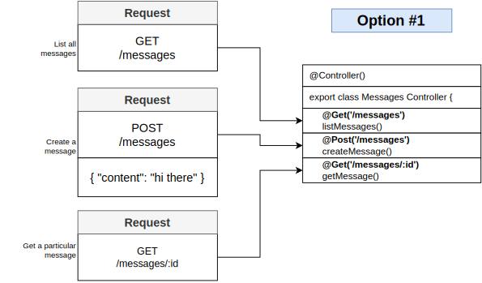
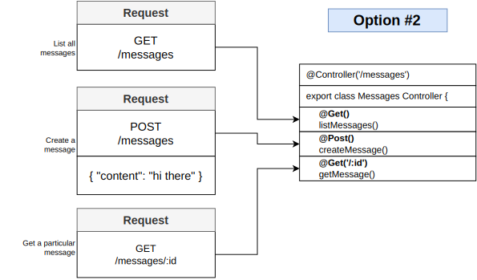

---

 

# Section 4: Validating Request Data with Pipes

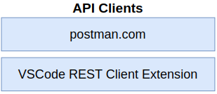
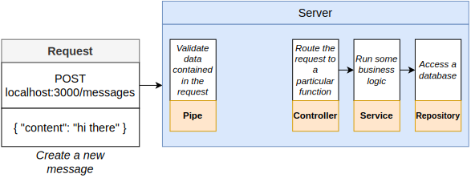
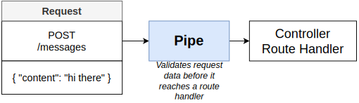
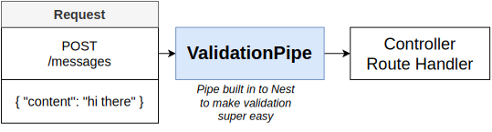
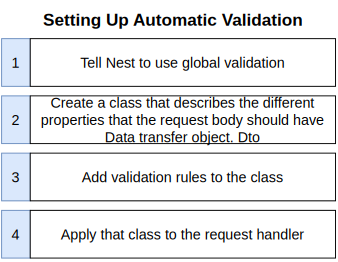
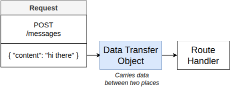
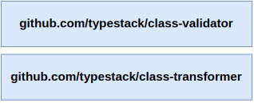
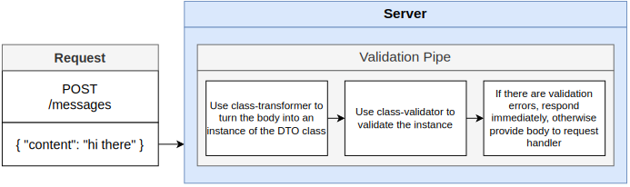
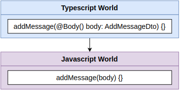

---

 

# Section 5: Nest Architecture: Services and Repositories

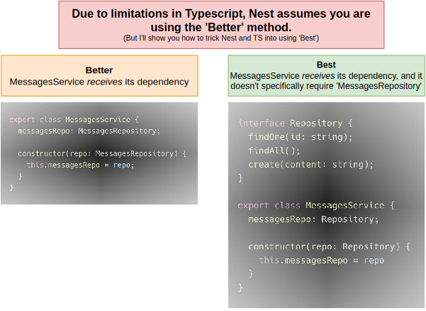
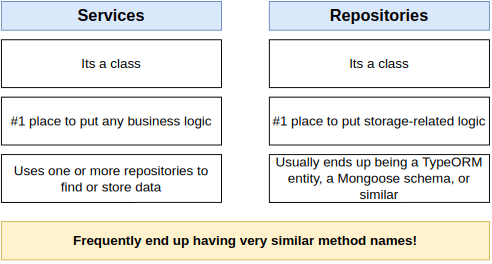
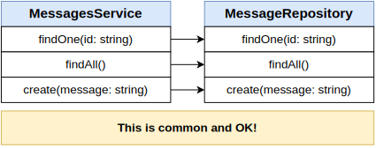
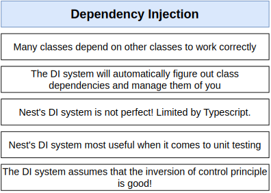

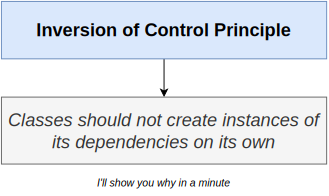
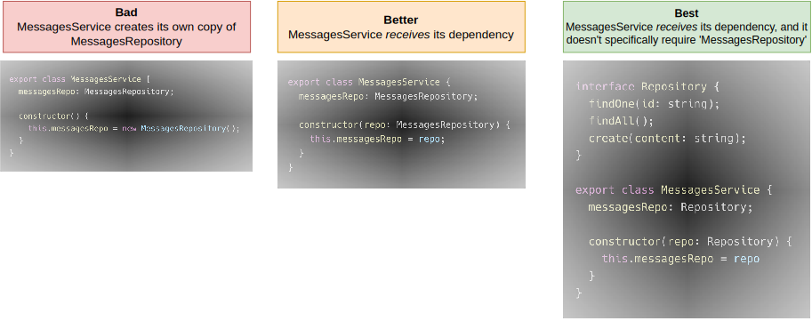

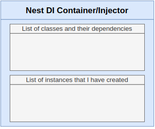
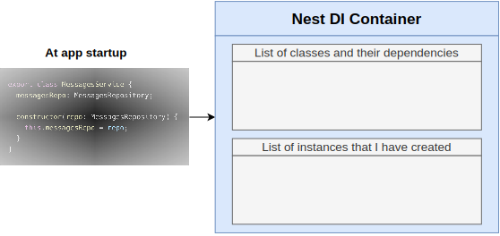
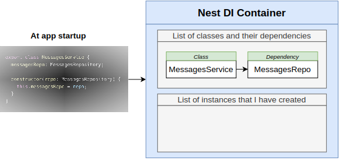
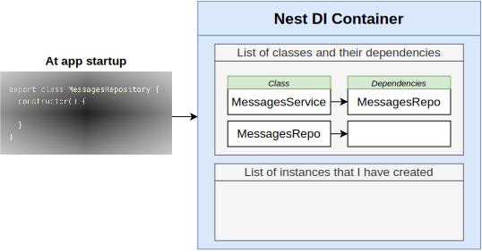
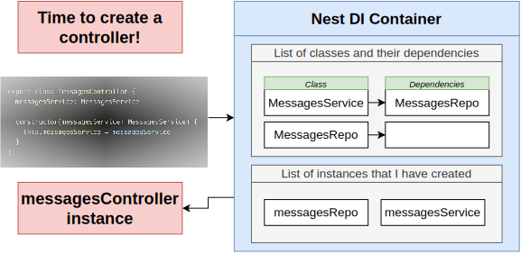
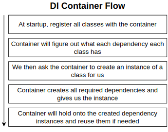
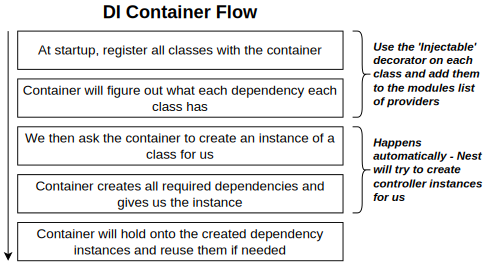

---

 

# Section 6: Nest Architecture: Organizing Code with Modules

---

 

# Section 7: Big Project Time!

---

 

# Section 8: Persisting Data with TypeORM

---

 

# Section 9: Creating and Saving User Data

---

 

# Section 10: Custom Data Serialization

---

 

# Section 11: Authentication From Scratch

---

 

# Section 12: Getting Started with Unit Testing

---

 

# Section 13: Integration Testing

---

 

# Section 14: Managing App Configuration

---

 

# Section 15: Relations with TypeORM

---

 

# Section 16: A Basic Permissions System

---

 

# Section 17: Query Builders with TypeORM

---

 

# Section 18: Production Deployment

---

 

# Section 19: [Bonus] Appendix: TypeScript

---

 

# div 2

# div 03

# div 04

# div 05

# div 07 - 03

# div 09

# div 10

---

## div 15

# div 18

